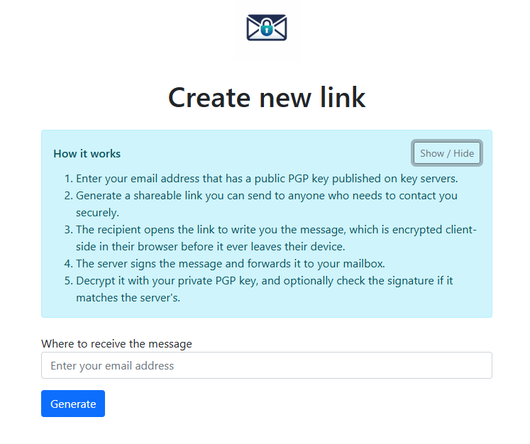
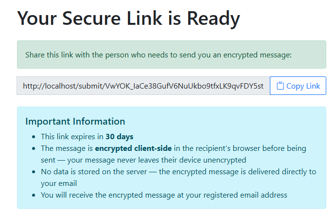
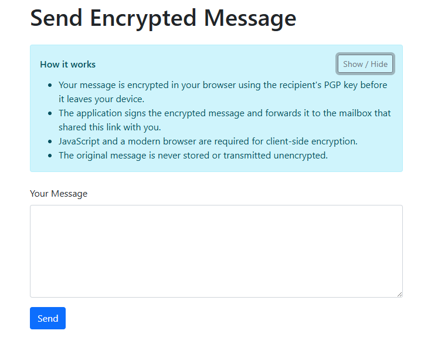
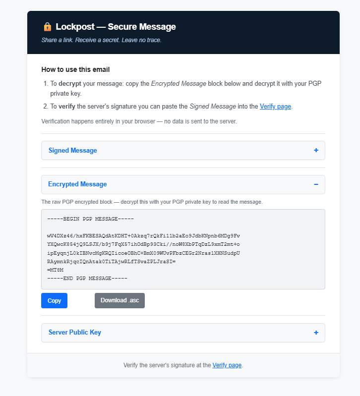
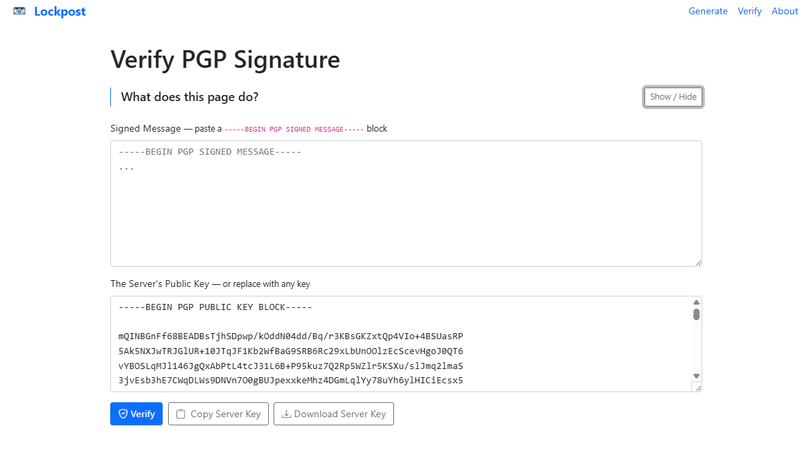

# Lockpost

> *Share a link. Receive a secret. Leave no trace.*

---

## Overview

Lockpost lets users receive PGP-encrypted messages through shareable links. It solves the problem of securely receiving sensitive information from people who aren't familiar with encryption.

---

## How it works

**1. Generate a link**

Enter your PGP-associated email address. The app looks up your public key on public key servers and generates a unique, time-limited shareable link.



---

**2. Share the link**

Copy the link and send it to whoever needs to contact you — by email, chat, or any other channel.



---

**3. Recipient writes a message**

The recipient opens the link and types their message. It is encrypted entirely in their browser using your public key before anything leaves their device.



---

**4. You receive the email**

The server signs the encrypted message with its own PGP key and forwards it to your inbox. The email contains the signed message, the raw encrypted block, and the server's public key.



---

**5. Verify the server's signature (optional)**

Paste the signed message and the server's public key into the Verify page to confirm the message was genuinely forwarded by this server and was not tampered with in transit. Verification runs entirely in the browser.



---

## Design principles

- No message storage — fully stateless, zero persistence
- No tracking or cookies
- Client-side encryption only (OpenPGP.js)
- Stateless tokens using AES-256-CBC + HMAC-SHA256 (30-day expiry)
- Server signs outgoing messages with its own PGP key

---

## Local Development Setup

**Prerequisites:** Docker and Docker Compose.

### 1. Clone and configure environment

```bash
git clone <repo-url>
cd lockpost
cp .env.example .env
```

The defaults in `.env.example` work for local Docker dev. The only value you may want to change is `APP_SECRET` — set it to any random string.

### 2. Start containers

```bash
docker-compose up -d
```

This starts three containers: `php` (PHP 8.3-FPM), `nginx` (reverse proxy on port 80), and `mailhog` (local mail catcher).

### 3. Install PHP dependencies

```bash
docker exec php composer install
```

### 4. Generate the server PGP key pair

The app requires a PGP key pair to sign outgoing messages. Run this once:

```bash
docker exec php bash /var/www/app/scripts/init-pgp.sh
```

This generates `config/pgp/private.key` and `config/pgp/public.key` inside the container. These files are gitignored and never committed.

### 5. Fix file permissions

The PHP-FPM process runs as `www-data`. After key generation (which runs as root), fix ownership:

```bash
docker exec php bash -c "chown -R www-data:www-data /var/www/app/var/ /var/www/app/config/pgp/"
```

### 6. Verify

The app is available at **http://localhost**.
MailHog (inspect outgoing emails) is at **http://localhost:8025**.

```bash
# Quick smoke test
docker exec php php bin/phpunit tests/BootstrapTest.php --no-coverage
```

---

## Environment Variables

Defined in `.env` (copy from `.env.example`):

| Variable | Description |
|---|---|
| `APP_ENV` | `dev` for local, `prod` for production |
| `APP_SECRET` | Random secret used for token encryption — change this |
| `MAILER_DSN` | SMTP connection string. Default points to MailHog: `smtp://mailhog:1025` |
| `MESSENGER_TRANSPORT_DSN` | Messenger transport. Default: `doctrine://default?auto_setup=0` |
| `PGP_PRIVATE_KEY_PASSPHRASE` | Passphrase for the server's PGP private key. The default `init-pgp.sh` generates keys with no passphrase (`%no-protection`), so leave this as the placeholder or set it to empty |

---

## Running Tests

```bash
# Full test suite
docker exec php php bin/phpunit --no-coverage

# Specific file
docker exec php php bin/phpunit tests/BootstrapTest.php --no-coverage
docker exec php php bin/phpunit tests/Service/PgpSigningServiceTest.php --no-coverage

# With coverage report
docker exec php php bin/phpunit --coverage-text
```

---

## Common Commands

```bash
# Clear Symfony cache
docker exec php php bin/console cache:clear

# Tail application logs
docker exec php tail -f var/log/dev.log

# Reinstall JS importmap assets
docker exec php php bin/console importmap:install

# Stop all containers
docker-compose down
```

---

## Architecture

### Services

| Service | Responsibility |
|---|---|
| `TokenLinkService` | Generates and validates time-limited encrypted tokens (AES-256-CBC + HMAC-SHA256) |
| `PgpKeyService` | Looks up public keys from key servers (keys.openpgp.org, keyserver.ubuntu.com, pgp.mit.edu) |
| `PgpSigningService` | Signs outgoing messages and verifies signatures using the server's GnuPG key |

### Tech stack

- **Backend:** PHP 8.3, Symfony 7.1
- **Frontend:** Stimulus, Symfony AssetMapper, OpenPGP.js, Bootstrap 5
- **Infrastructure:** Docker, NGINX, PHP-FPM, MailHog
- **Testing:** PHPUnit 9.5

### PGP key storage

Keys live in `config/pgp/` (gitignored):

```
config/pgp/
  private.key       # Server signing key  (chmod 600, owner www-data)
  public.key        # Server public key   (chmod 644, owner www-data)
  key-config/       # GnuPG home directory
    gpg.conf        # GPG config (pinentry-mode loopback, no-protection)
```

---

## Project History

Lockpost started as a project for TAP or *Advanced Programming Techniques*, originally designed and developed at [gitlab.com/zer0lis/sym-pgp-ony](https://gitlab.com/zer0lis/sym-pgp-ony). It has since been redesigned and extended into a production-ready application.

---

## Future Plans

- Deploy it live
- Better looks
