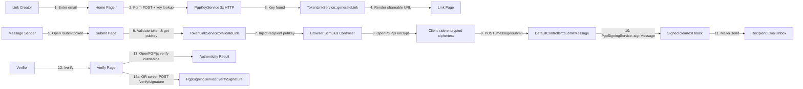
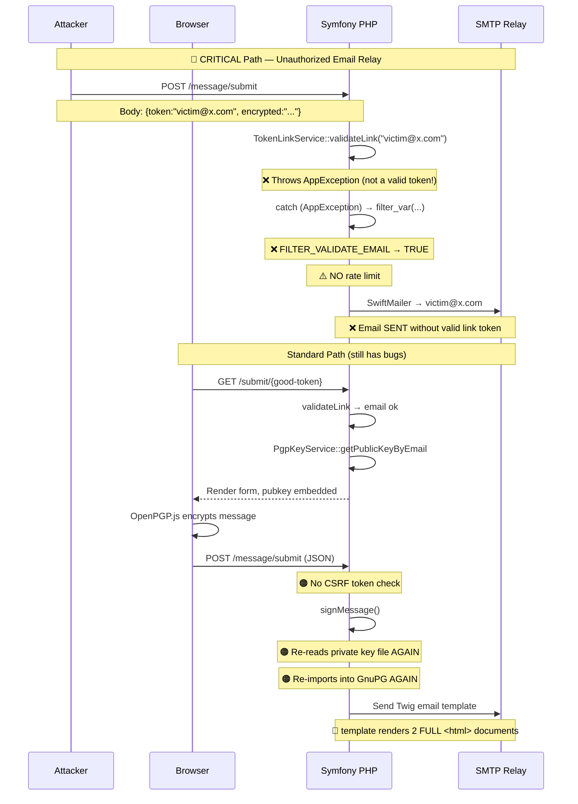
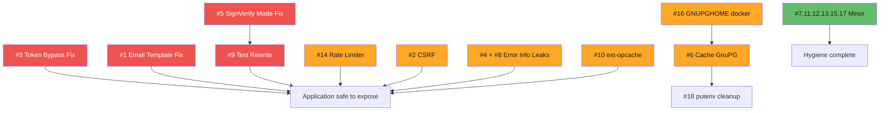

# Lockpost — Technical Code Review Report

> **Review Date:** 2026-08-15
> **Review Scope:** Entire codebase (`../../../src`, `../../../assets`, `../../../config`, `../../../templates`, `../../../tests`, `../../../docker`, `../../../scripts`)
> **Review Type:** Security audit + functional bug analysis + architecture review + configuration review
> **Validation:** 2 independent cross-review passes — **100% consensus (18/18 issues confirmed)**
> **Framework:** PHP 8.2+, Symfony 7.1, Stimulus, Docker/NGINX/PHP-FPM
> **Total Issues:** 18 (Critical: 4, Major: 8, Minor: 6)

---

## 1. Executive Summary

Lockpost is a Symfony application that enables PGP-encrypted messaging via shareable time-limited links. The application follows a strong security design (client-side encryption, zero persistence, stateless tokens) but contains **multiple critical implementation flaws** that undermine the security model.

### Key Findings

| Severity | Count | Description |
|----------|-------|-------------|
| 🔴 CRITICAL | 4 | **4 showstoppers prevent production deployment.** Malformed email output, an open-relay email bypass, broken signature verification round-trip, and a test that codifies the broken verify behavior. |
| 🟠 MAJOR | 8 | **Significant security and performance issues.** Missing CSRF on a state-changing endpoint, 2 instances of error-information disclosure, PGP key re-read+import on every sign call, wrong Composer extension name, missing rate-limiting on the email endpoint, and a GNUPGHOME path mismatch between Docker and PHP code. |
| 🟡 MINOR | 6 | **Code quality & hygiene.** Stale PHPDoc, dead configuration files, unused imports, key-server lookup latency tradeoff, malformed .env line, and inconsistent env-var state management. |

### Must-Fix Before Production

1. **Issue #3 (Token Bypass)** completely negates the link-based authorization model. An unauthenticated attacker can spam arbitrary email addresses.
2. **Issue #1 (Email Template Duplicate)** produces double-rendered HTML with 2 `<html>` documents — every outgoing email is broken.
3. **Issue #5 + #9 (Sign/Verify Incompatibility)** — signature verification cannot work in the current code; a test explicitly expects verify to fail on freshly signed content.
4. **Issue #14 + #3 combined** turn this application into an open spam relay.
5. **Issue #2 + #8** — CSRF and error disclosure on the JSON POST endpoint.

---

## 2. Project Architecture

### 2.1 Service Responsibility Map

| Class | File | Responsibility |
|-------|------|----------------|
| `DefaultController` | `../../../src/Controller/DefaultController.php` | HTTP routing: homepage link generation, submit page render, message send, verify page, verify server-side endpoint, server-key download |
| `TokenLinkService` | `../../../src/Service/TokenLinkService.php` | Stateless encrypted link tokens (AES-256-CBC + HMAC-SHA256, HKDF key derivation, 30-day expiry) |
| `PgpKeyService` | `../../../src/Service/PgpKeyService.php` | Concurrent lookup of public PGP keys on 3 servers (keys.openpgp.org, keyserver.ubuntu.com, pgp.mit.edu) |
| `PgpSigningService` | `../../../src/Service/PgpSigningService.php` | Server-side signing of messages via GnuPG extension; server-side signature verification; public key file reader |
| `ErrorHandler` | `../../../src/Exception/ErrorHandler.php` | Service & controller exception wrapper (logger + HTML response or rethrow) |
| `AppException` | `../../../src/Exception/AppException.php` | Domain exception marker class (empty subclass of Exception) |
| `MessageSubmitRequest` | `../../../src/Form/MessageSubmitRequest.php` | DTO + validator for JSON POST at `/message/submit` |
| `EmailFormType` | `../../../src/Form/EmailFormType.php` | Homepage email input form |
| `PgpVerifySignatureFormType` | `../../../src/Form/PgpVerifySignatureFormType.php` | Server-side verify signature form (3 separate PGP block textareas) |

### 2.2 Business Flow (User Journey)



### 2.3 Technical Call Flow — Vulnerable Paths Annotated



---

## 3. Detailed Findings

Each issue below has been independently validated by two separate review passes. Both reviewers confirmed existence and severity for **all 18 issues**.

### 3.1 Critical Issues (Must Fix Immediately)

---

#### **Issue #1 — Duplicate HTML Document in Email Template**
| Field | Value |
|-------|-------|
| **Severity** | 🔴 CRITICAL |
| **File** | `../../../templates/email/message.html.twig` |
| **Lines** | 1–212 |
| **Impact** | Every outgoing email contains **two complete HTML documents concatenated**. The first document (lines 1–102) is missing its closing tags and spills directly into a second DOCTYPE at line 103. Email clients will render this unpredictably, display garbled content, or drop the second half entirely including signature verification instructions. |
| **Root Cause** | File contains an unintentional full copy of itself appended mid-file. The first document never closes `</table></body></html>`; line 103 opens a second `<!DOCTYPE html>`. |
| **Suggested Fix** | Delete lines 103–212 (the second duplicate). Add missing closing tags `</table></td></tr></table></body></html>` to the first document at ~line 102. |

---

#### **Issue #3 — Token Bypass Creates Open Email Relay**
| Field | Value |
|-------|-------|
| **Severity** | 🔴 CRITICAL |
| **File** | `../../../src/Controller/DefaultController.php` |
| **Lines** | 182–194 |
| **Impact** | The whole authorization model of "only people with a valid shareable link can send" is defeated. An unauthenticated network attacker can POST to `/message/submit` with `{token: "anyemail@example.com", encryptedMessage: "..."}` and send emails to arbitrary recipients. No link token is needed. Combined with the lack of rate limiting (Issue #14), this makes Lockpost a usable open spam relay. |
| **Root Cause** | Lines 185–188: When `validateLink()` throws `AppException`, the code falls back to `filter_var($tokenOrRecipient, FILTER_VALIDATE_EMAIL)`. Any syntactically valid email in the `token` field bypasses link authentication entirely. |
| **Suggested Fix** | Remove the `filter_var` fallback entirely. When `validateLink()` throws, return the 400 'Invalid or expired submission token' error unconditionally. |

```php
// BEFORE (vulnerable):
$tokenOrRecipient = $dto->getToken();
try {
    $recipientEmail = $this->linkService->validateLink($tokenOrRecipient);
} catch (AppException $e) {
    if (filter_var($tokenOrRecipient, FILTER_VALIDATE_EMAIL)) {   // ❌ REMOVE THIS BRANCH
        $recipientEmail = $tokenOrRecipient;
    } else {
        return $this->json([...], Response::HTTP_BAD_REQUEST);
    }
}

// AFTER (secure):
try {
    $recipientEmail = $this->linkService->validateLink($dto->getToken());
} catch (AppException) {
    return $this->json([
        'success' => false,
        'error'   => 'Invalid or expired submission token',
    ], Response::HTTP_BAD_REQUEST);
}
```

---

#### **Issue #5 — Sign/Verify API Mode Mismatch (Fundamentally Incompatible)**
| Field | Value |
|-------|-------|
| **Severity** | 🔴 CRITICAL |
| **File** | `../../../src/Service/PgpSigningService.php` |
| **Lines** | 99–150 + caller at `DefaultController.php` lines 274–278 |
| **Impact** | Signature verification cannot work with self-signed content. The server-side `verifyIsValidSignature` endpoint always fails for messages produced by `signMessage()`. This affects any user relying on the POST `/verify/signature` form (Stimulus client-side verify works, so verify page currently works for users with JS). |
| **Root Cause** | `signMessage()` calls `$gpg->sign($message)` which defaults to `gnupg::SIG_MODE_CLEAR`, producing a single **combined** cleartext-signed PGP block. In contrast, `verifySignature()` calls `$gpg->verify($signature, $message)`, which expects a **detached** signature blob plus a separate plaintext message. These are mutually exclusive modes in the PHP GnuPG extension. |
| **Suggested Fix** | Two valid approaches — choose one consistently:

**Option A — Use Detached Signatures:**
```php
// signMessage:
$gpg->setsignmode(gnupg::SIG_MODE_DETACHED);
$signature = $gpg->sign($message);
// return [$message, $signature];

// verifySignature stays the same:
// $gpg->verify($detachedSignature, $plaintextMessage);
```

**Option B — Use Combined Cleartext Signatures:**
```php
// signMessage stays: returns combined block via gnupg::SIG_MODE_CLEAR
// verifySignature changes to:
$result = $gpg->verify($cleartextSignedBlock, false);  // no 2nd arg
```

Option B is recommended for current UX because the email template already embeds the combined signed block as a single copy-paste field.

---

#### **Issue #9 — Test Codifies Broken Sign/Verify Round-Trip**
| Field | Value |
|-------|-------|
| **Severity** | 🔴 CRITICAL |
| **File** | `../../../tests/Service/PgpSigningServiceTest.php` |
| **Lines** | 54–64 |
| **Impact** | Test enforces broken behavior as truth. CI will treat a fixed sign/verify implementation as a regression. Also blocks automated detection of the underlying bug. |
| **Root Cause** | `testVerifySigning()` signs a message, then calls `verifySignature()` on the result, and asserts that an `AppException` with message 'verify failed' **MUST** be thrown. |
| **Suggested Fix** | After fixing Issue #5 above, rewrite to:
```php
public function testVerifySigning(): void
{
    $message   = 'Test message to verify';
    $signature = $this->pgpSigningService->signMessage($message);
    $publicKey = file_get_contents($this->testPgpDir . '/public.key');

    // If Option B (combined cleartext):
    $verified = $this->pgpSigningService->verifySignature(
        $message,       // or pass combined block depending on chosen API
        $signature,
        $publicKey
    );
    $this->assertTrue($verified);
}
```

---

### 3.2 Major Issues (Fix Before Production)

---

#### **Issue #2 — No CSRF Protection on `/message/submit` JSON Endpoint**
| Field | Value |
|-------|-------|
| **Severity** | 🟠 MAJOR |
| **File** | `../../../src/Controller/DefaultController.php` |
| **Lines** | 154–223 |
| **Impact** | A third-party site can craft a page that forces a victim's browser to submit to `/message/submit` via a cross-origin form POST with `text/plain` content type, or via `fetch` with `credentials: include`. With Session enabled, this is a real CSRF risk for triggering outbound emails. |
| **Root Cause** | Symfony's `csrf_protection: true` (framework.yaml) only auto-protects Symfony Form submissions. The `submitMessage` endpoint manually JSON-decodes the raw body and never calls `isCsrfTokenValid()`. |
| **Suggested Fix** | 1) Generate a CSRF token in `submit()` action, pass to template as `data-` attr; 2) Submit it alongside the JSON body; 3) Validate with `$this->isCsrfTokenValid('submit_message', $data['_csrf_token'])` before processing. OR enable the `symfony/security-csrf` token manager explicitly for stateless JSON endpoints using header-based tokens. |

---

#### **Issue #4 — Exception Message Leaked to End User (HTML)**
| Field | Value |
|-------|-------|
| **Severity** | 🟠 MAJOR |
| **File** | `../../../src/Exception/ErrorHandler.php` |
| **Lines** | 24–35 |
| **Impact** | Internal exception messages (potentially file paths, PGP diagnostic strings, filesystem/configuration internals) are embedded directly into the user-facing HTML error page. Violates OWASP secure-error-handling best practice. |
| **Root Cause** | Line 31: `htmlspecialchars($e->getMessage())` is rendered into the response body. While escaping prevents XSS, the content is still leaked. |
| **Suggested Fix** | Render only `$customMessage` in HTML. Always log `$e->getMessage()` (already done on line 26). Optionally append a generic 'If this problem persists contact support.' message. |

```php
// BEFORE:
htmlspecialchars($e->getMessage())   // ❌

// AFTER (production safe):
htmlspecialchars($customMessage)
```

---

#### **Issue #6 — Private Key Re-read & Re-imported On Every Sign Call**
| Field | Value |
|-------|-------|
| **Severity** | 🟠 MAJOR |
| **File** | `../../../src/Service/PgpSigningService.php` |
| **Lines** | 99–111, 43–48, 60–89 |
| **Impact** | Performance and GnuPG keyring bloat. The constructor calls `initializeGnuPG()` once (reading file, importing key, adding sign key). Then `signMessage()` calls it **again** on every invocation. For N sign operations there are N+1 file reads and N+1 GnuPG key imports. |
| **Root Cause** | Line 102: `$gpg = $this->initializeGnuPG()` inside `signMessage()`, ignoring that constructor already did this work. No cached gnupg class property is used. |
| **Suggested Fix** | Store initialized `gnupg` object as a private readonly property, set once in constructor. Remove the initializeGnuPG call from `signMessage()` and from `verifySignature()` line 126–128, reusing the cached instance + putenv set once. |

---

#### **Issue #8 — Exception Message Leaked in JSON Response**
| Field | Value |
|-------|-------|
| **Severity** | 🟠 MAJOR |
| **File** | `../../../src/Controller/DefaultController.php` |
| **Lines** | 216–222 |
| **Impact** | Same as Issue #4 but on the JSON API surface. PGP diagnostics, file path errors, mailer connection strings, mail-server SMTP responses, etc. are returned directly as the JSON `error` field to the calling JavaScript client. |
| **Root Cause** | `'error' => $e->getMessage()` in the outer catch-all Exception handler. |
| **Suggested Fix** | Replace with a fixed message: `'error' => 'An internal error occurred while sending the message.'` Continue logging the real `$e` with full context on line 217 (already present). |

---

#### **Issue #10 — Wrong Composer Platform Extension Name**
| Field | Value |
|-------|-------|
| **Severity** | 🟠 MAJOR |
| **File** | `../../../composer.json` |
| **Lines** | 47 |
| **Impact** | `composer check-platform-reqs` will report failure on correctly-configured PHP 8.x installations because `ext-zend-opcache` is not the recognized name for the bundled OPcache. Installations using `--check-platform-reqs` flag will abort. |
| **Root Cause** | Line 47 reads `"ext-zend-opcache": "*"` — legacy PECL-era name. Since PHP 5.5+, OPcache is bundled in core and the platform extension name is `ext-opcache`. |
| **Suggested Fix** |
```json
"ext-opcache": "*"
```

---

#### **Issue #14 — No Rate Limiting on Email Endpoint**
| Field | Value |
|-------|-------|
| **Severity** | 🟠 MAJOR |
| **File** | `../../../src/Controller/DefaultController.php` |
| **Lines** | 154–223 (and missing rate limiter config) |
| **Impact** | Unbounded outbound email sending per IP / per request. Combined with Issue #3 (token bypass), an attacker can spam thousands of recipients in a loop. Even after fixing #3, a compromised valid link token could be used for a flood. |
| **Root Cause** | No `symfony/rate-limiter` configured, and no manual throttle code exists. |
| **Suggested Fix** | 1) Require `symfony/rate-limiter`; 2) Add rate_limiter config under `framework.yaml` with per-IP + per-token sliding window limits (e.g., 5 req/minute per IP, 10 req/hour per token); 3) Call `$limiter->consume()` in submitMessage before sign/send. Return HTTP 429 on limit exceeded. |

---

#### **Issue #16 — GNUPGHOME Mismatch Between Docker Env Var and PHP Code**
| Field | Value |
|-------|-------|
| **Severity** | 🟠 MAJOR |
| **File** | `../../../docker-compose.yml` line 30, `../../../config/services.yaml` line 10 |
| **Impact** | Container-wide process env says `GNUPGHOME=/var/www/app/config/pgp`, but every code path that uses GnuPG calls `putenv(GNUPGHOME=/var/www/app/config/pgp/key-config)`. Current code works ONLY because every GnuPG-using method calls `putenv` first. Any future code path, script, or shell command that uses the GnuPG CLI or extension without calling `initializeGnuPG()` first will operate on the wrong directory and fail or leak. |
| **Root Cause** | `../../../docker-compose.yml` php.environment was set to the parent `../../../config/pgp` directory, but PgpSigningService's `$keyConfigPath` points to the `key-config` SUBDIRECTORY. |
| **Suggested Fix** |
```yaml
# docker-compose.yml php service:
environment:
  - GNUPGHOME=/var/www/app/config/pgp/key-config
```
This matches `%app.pgp.key_config_path%` exactly.

---

### 3.3 Minor Issues (Code Quality / Hygiene)

---

#### **Issue #7 — Stale Constructor PHPDoc**
| Field | Value |
|-------|-------|
| **Severity** | 🟡 MINOR |
| **File** | `../../../src/Service/PgpSigningService.php` |
| **Lines** | 18–31 |
| **Issue** | PHPDoc declares `@param ErrorHandler $errorHandler` as first constructor arg; real signature takes only 4 string paths. All subsequent parameter descriptions and the @throws clause reference an old version of the class. Static analysis tools (PHPStan, Psalm) will report mismatches. |
| **Fix** | Rewrite PHPDoc to match current 4 string parameters, or switch to native PHP 8 typed constructor + remove doc entirely (let code be self-documenting). |

---

#### **Issue #11 — Dead Doctrine Messenger Configuration**
| Field | Value |
|-------|-------|
| **Severity** | 🟡 MINOR |
| **Files** | `../../../.env.example` line 13, `../../../.env.test` line 15 |
| **Issue** | `MESSENGER_TRANSPORT_DSN=doctrine://default?auto_setup=0` references a Doctrine database. No `doctrine.yaml`, no `DATABASE_URL`, no `doctrine/orm` or `doctrine/dbal` in composer.json require section. If messenger's failure_transport (doctrine) is ever needed it will crash. |
| **Fix** | Set transport to `sync://` explicitly OR add full Doctrine + DB setup. Recommended: `sync://` for current single-process design, and document the async migration path. |

---

#### **Issue #12 — Unused Import: TransportExceptionInterface**
| Field | Value |
|-------|-------|
| **Severity** | 🟡 MINOR |
| **File** | `../../../src/Controller/DefaultController.php` line 15 |
| **Issue** | `use Symfony\Component\Mailer\Exception\TransportExceptionInterface;` is imported but no code references the name (no catch, no type hint, no `instanceof`). |
| **Fix** | Delete line 15. |

---

#### **Issue #13 — Dead Config File: config/packages/gpg.yaml**
| Field | Value |
|-------|-------|
| **Severity** | 🟡 MINOR |
| **File** | `config/packages/gpg.yaml` (entire file) |
| **Issue** | Defines a full nested `gpg.dev.*` and `gpg.prod.*` parameter tree including hardcoded default key fingerprint. No code in the project ever references `%gpg.dev%` or `%gpg.prod%`. The file's own closing comment admits: "PgpSigningService is wired in config/services.yaml using app.pgp.* parameters." The file is 100% dead weight, plus the hardcoded fingerprint (`526305FE...`) is environment-specific — another dev's generated key will have a different fingerprint. |
| **Fix** | Delete the file. |

---

#### **Issue #15 — Key Lookup Always Waits for Slowest Server**
| Field | Value |
|-------|-------|
| **Severity** | 🟡 MINOR |
| **File** | `../../../src/Service/PgpKeyService.php` lines 78–110 |
| **Issue** | Fires 3 concurrent HTTP requests, then enters a blocking `foreach` calling `getContent()` on each. Callers short-circuit on the first valid key, but by then all 3 responses have been fully consumed. Latency is bounded by the slowest server, not the fastest one. |
| **Root Cause** | Tradeoff made for test compatibility (MockResponse destructor throws if a 4xx response is GC'd unconsumed). |
| **Fix** | Accept the MockResponse destructor exception workaround in tests (e.g., wrap collection in try/catch or always explicitly consume). Stream `$responses` as each HTTP stream chunk resolves, return the FIRST 2xx body that contains `BEGIN PGP PUBLIC KEY BLOCK`. Falls back only if key block is malformed. |

---

#### **Issue #17 — Leading Whitespace Breaks .env.test Line**
| Field | Value |
|-------|-------|
| **Severity** | 🟡 MINOR |
| **File** | `../../../.env.test` line 29 |
| **Issue** | `     SESSION_AUTO_START=true` is preceded by 5 space characters. Symfony Dotenv parses each line; leading whitespace makes the line fail token recognition. The variable is silently NOT set in the test environment. |
| **Fix** | Delete leading spaces: `SESSION_AUTO_START=true` |

---

#### **Issue #18 — Inconsistent putenv(GNUPGHOME) Calls**
| Field | Value |
|-------|-------|
| **Severity** | 🟡 MINOR |
| **File** | `../../../src/Service/PgpSigningService.php` (scattered) |
| **Issue** | `initializeGnuPG()` sets putenv; `verifySignature()` sets putenv again on line 126 (redundant); `getServerPublicKey()` does NOT set it (harmless today because it uses `file_get_contents`, not GnuPG API). Combined with Issue #16 this is fragile. Future code edits that switch to a GnuPG call inside getServerPublicKey will hit the wrong home directory if the last method that ran was not initialize/verify. |
| **Fix** | Part of Issue #6 refactor: Set putenv exactly once in the constructor. All methods reuse the cached `gnupg` property. Remove all other putenv calls. |

---

## 4. Issue Cross-Reference Summary

### 4.1 Consolidation Index

| # | Severity | Issue Name | Dependencies / Related |
|---|----------|------------|------------------------|
| 1 | 🔴 | Email template duplicate | Standalone — 1 line deletion |
| 2 | 🟠 | Missing CSRF on /message/submit | Complements #3 and #14 on defense-in-depth axis |
| 3 | 🔴 | Token bypass → open relay | MUST be fixed first; enables spam abuse |
| 4 | 🟠 | Exception info leak (HTML) | Pair fix with #8 |
| 5 | 🔴 | Sign/verify mode mismatch | Requires #9 to be fixed in same batch |
| 6 | 🟠 | GnuPG re-import every sign | Includes #18 fix (cached instance + single putenv) |
| 7 | 🟡 | Stale constructor PHPDoc | Standalone |
| 8 | 🟠 | Exception info leak (JSON) | Pair fix with #4 |
| 9 | 🔴 | Test codifies broken verify | Depends on #5 being implemented correctly |
| 10 | 🟠 | ext-zend-opcache naming | Standalone composer.json edit |
| 11 | 🟡 | Dead doctrine messenger config | Standalone env edits |
| 12 | 🟡 | Unused import | 1 line deletion |
| 13 | 🟡 | Dead gpg.yaml | File deletion |
| 14 | 🟠 | Missing rate limiter | After #3 fixed; closes spam vector window |
| 15 | 🟡 | Key lookup waits for all servers | Standalone perf refactor |
| 16 | 🟠 | GNUPGHOME path mismatch | docker-compose.yml 1 line edit |
| 17 | 🟡 | .env.test whitespace | 1 line trim |
| 18 | 🟡 | putenv inconsistency | Covered by #6 refactor |

### 4.2 Dependency Graph for Fixing Order



---

## 5. Validation Methodology

Each issue was:
1. **Identified** by main review pass (full codebase read).
2. **Dispatched** to two independent sub-review agents in parallel, each given the full list of 18 candidate issues plus access to all relevant source files.
3. **Scored** by each validator on: `exists` (bool), `severity` (critical/major/minor/false_positive), and textual `reasoning`.
4. **Consolidated** by consensus.

**Results:**
| Metric | Value |
|--------|-------|
| Validators | 2 (blind, independent) |
| Issues proposed | 18 |
| 2/2 confirmed | 18 (100%) |
| 1/2 confirmed | 0 |
| 0/2 confirmed (rejected) | 0 |
| Severity disagreement | 0 (exact severity match on all 18) |

Both validators agreed on both existence and severity for **every single issue**, giving high confidence in the findings list above.

---

## 6. Recommended Production Checklist

Before deploying to a live environment, all of the following must be green:

- [ ] **Issue #1** resolved — email template produces exactly one valid HTML document
- [ ] **Issue #3** resolved — `/message/submit` NEVER falls back to raw email
- [ ] **Issue #5 + #9** resolved — sign/verify round-trip works; test now asserts success
- [ ] **Issue #2** resolved — CSRF validated on every POST to `/message/submit`
- [ ] **Issue #4 + #8** resolved — no raw exception messages escape to clients
- [ ] **Issue #10** resolved — composer platform check passes (`ext-opcache`)
- [ ] **Issue #14** resolved — rate limiter configured and enforced
- [ ] **Issue #16** resolved — Docker GNUPGHOME env matches services.yaml `key_config_path`
- [ ] **Issue #6 + #18** resolved — cached gnupg instance, putenv called once only
- [ ] **Remaining minor** (#7, #11, #12, #13, #15, #17) cleaned up
- [ ] Full PHPUnit suite passes (`bin/phpunit --no-coverage`)
- [ ] Manual smoke test: create link → send message → receive email → verify signature works
- [ ] `APP_SECRET` rotated to a cryptographically random 32+ byte string
- [ ] `PGP_PRIVATE_KEY_PASSPHRASE` set to a real passphrase (not empty) and stored via env/secrets
- [ ] File permissions verified: `../../../config/pgp/private.key` = 0600, owned by `www-data`

---

## 7. Files Referenced

All absolute file paths (for quick navigation in IDE):

- [DefaultController.php](file:///c:/Users/mihai/Documents/GitHub/sym-pgp-ony/src/Controller/DefaultController.php)
- [TokenLinkService.php](file:///c:/Users/mihai/Documents/GitHub/sym-pgp-ony/src/Service/TokenLinkService.php)
- [PgpKeyService.php](file:///c:/Users/mihai/Documents/GitHub/sym-pgp-ony/src/Service/PgpKeyService.php)
- [PgpSigningService.php](file:///c:/Users/mihai/Documents/GitHub/sym-pgp-ony/src/Service/PgpSigningService.php)
- [ErrorHandler.php](file:///c:/Users/mihai/Documents/GitHub/sym-pgp-ony/src/Exception/ErrorHandler.php)
- [AppException.php](file:///c:/Users/mihai/Documents/GitHub/sym-pgp-ony/src/Exception/AppException.php)
- [MessageSubmitRequest.php](file:///c:/Users/mihai/Documents/GitHub/sym-pgp-ony/src/Form/MessageSubmitRequest.php)
- [EmailFormType.php](file:///c:/Users/mihai/Documents/GitHub/sym-pgp-ony/src/Form/EmailFormType.php)
- [PgpVerifySignatureFormType.php](file:///c:/Users/mihai/Documents/GitHub/sym-pgp-ony/src/Form/PgpVerifySignatureFormType.php)
- [services.yaml](file:///c:/Users/mihai/Documents/GitHub/sym-pgp-ony/config/services.yaml)
- [gpg.yaml](file:///c:/Users/mihai/Documents/GitHub/sym-pgp-ony/config/packages/gpg.yaml)
- [framework.yaml](file:///c:/Users/mihai/Documents/GitHub/sym-pgp-ony/config/packages/framework.yaml)
- [security.yaml](file:///c:/Users/mihai/Documents/GitHub/sym-pgp-ony/config/packages/security.yaml)
- [message.html.twig](file:///c:/Users/mihai/Documents/GitHub/sym-pgp-ony/templates/email/message.html.twig)
- [base.html.twig](file:///c:/Users/mihai/Documents/GitHub/sym-pgp-ony/templates/base.html.twig)
- [submit.html.twig](file:///c:/Users/mihai/Documents/GitHub/sym-pgp-ony/templates/default/submit.html.twig)
- [verify.html.twig](file:///c:/Users/mihai/Documents/GitHub/sym-pgp-ony/templates/default/verify.html.twig)
- [index.html.twig](file:///c:/Users/mihai/Documents/GitHub/sym-pgp-ony/templates/default/index.html.twig)
- [submit_controller.js](file:///c:/Users/mihai/Documents/GitHub/sym-pgp-ony/assets/controllers/submit_controller.js)
- [verify_controller.js](file:///c:/Users/mihai/Documents/GitHub/sym-pgp-ony/assets/controllers/verify_controller.js)
- [PgpSigningServiceTest.php](file:///c:/Users/mihai/Documents/GitHub/sym-pgp-ony/tests/Service/PgpSigningServiceTest.php)
- [PgpKeyServiceTest.php](file:///c:/Users/mihai/Documents/GitHub/sym-pgp-ony/tests/Service/PgpKeyServiceTest.php)
- [DefaultControllerTest.php](file:///c:/Users/mihai/Documents/GitHub/sym-pgp-ony/tests/Controller/DefaultControllerTest.php)
- [docker-compose.yml](file:///c:/Users/mihai/Documents/GitHub/sym-pgp-ony/docker-compose.yml)
- [init-pgp.sh](file:///c:/Users/mihai/Documents/GitHub/sym-pgp-ony/scripts/init-pgp.sh)
- [composer.json](file:///c:/Users/mihai/Documents/GitHub/sym-pgp-ony/composer.json)
- [phpunit.xml.dist](file:///c:/Users/mihai/Documents/GitHub/sym-pgp-ony/phpunit.xml.dist)
- [.env.example](file:///c:/Users/mihai/Documents/GitHub/sym-pgp-ony/.env.example)
- [.env.test](file:///c:/Users/mihai/Documents/GitHub/sym-pgp-ony/.env.test)

---

*End of report. Generated 2026-08-15.*
